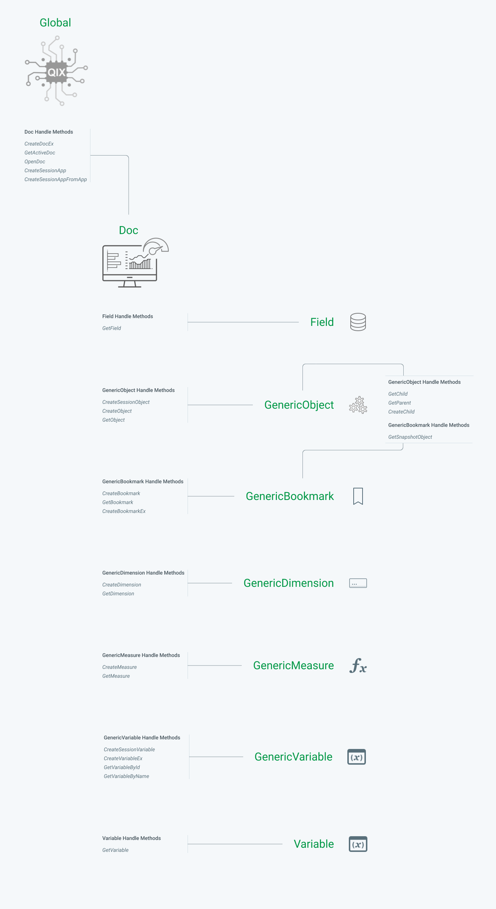

# QAE Hierarchy

The Qlik Engine API for version 12.556.0 has 298 API methods. The 298 methods are split across Classes (9 to be exact), but all of them effectively serve the same job: take a request from a client and pass it to the engine; Then return a response from the engine.

There are, however, 25 API methods that are different than the rest. They serve a special purpose that when they are called, they create or find an object on the Qlik engine, and return a reference (handle) of that object.

This concept is what often leads to confusion when new developers learn the Qlik Engine API. How do I go from connecting to the engine and getting a Global class object, to building a HyperCube handle stored within a GenericObject class object?

 <!-- In a class, it isn't always clear what methods are creating handles to other classes, and what methods are just executing an action and returning a response in the form of data. The intention of this documentation is to clarify the hierarchy of API Classes, and how to navigate the tree. -->

## Classes and Their Handle Creators

### Global

Above we see the 9 API classes and their handle-creator methods. Starting at the top, we have our **Global** class. This is the class type we get when we first connect to the Qlik Engine and has 5 handle-creator methods (**_CreateDocEx_**, **_GetActiveDoc_**, **_OpenDoc_**, **_CreateSessionApp_**, and **_CreateSessionAppFromApp_**), each of which will create a handle of the [**Doc**](#doc) class type. Any other API method that is part of the Global class will request some action and sometimes return data, but will not return a new handle.

This class is used to interact with any data or objects that are defined at the Engine level.

### Doc

Doc class methods allow you to interact with any of the properties defined on a specific application, or any objects that are defined within an app (ex. sheets, charts, variables etc.). Doc has 16 handle-creator methods, creating 7 different class types among them.

**_GetField_** creates a [**Field**](#field) class type handle

**_CreateSessionObject_**, **_CreateObject_**, and **_GetObject_** create a [**GenericObject**](#genericobject) class type handle

**_CreateBookmark_**, **_GetBookmark_**, and **_CreateBookmarkEx_** create a [**GenericBookmark**](#genericbookmark) class type handle

**_CreateDimension_** and **_GetDimension_** create a [**GenericDimension**](#genericdimension) class type handle

**_CreateMeasure_** and **_GetMeasure_** create a [**GenericMeasure**](#genericmeasure) class type handle

**_CreateSessionVariable_**, **_CreateVariableEx_**,**_GetVariableById_**, and **_GetVariableByName_** create a [**GenericVariable**](#genericvariable) class type handle

**_GetVariable_** creates a [**Variable**](#variable) class type handle

### Field

The Field class methods allow you to interact with fields that exist in the data model of the application the field belongs to. With it, you are able to get data on a field's properties and select field values. It's typically a quick way to interact with a field, but more robust applications typically use ListObject's defined within a GenericObject class type.

### GenericObject

The GenericObject class type is probably the most versatile and frequently used class type in the Engine API. The purpose of GenericObjects are often confusing to understand as its uses are, as its name implies, generic and ambiguous. At its core, a GenericObject in Qlik is a container for the definitions of data structures, whose values can be calculated when requested.

The most common use cases for GenericObjects are building HyperCubes, ListObjects, or single Expressions. Any visualization you build in a Qlik Sense Application, whether it's a bar chart, scatter plot, or straight table, is rendered by means of a HyperCube. When you drop a bar chart on a Qlik Sense sheet and give it a Dimension and Measure definition, the Qlik client is placing those dimensions and measures into a HyperCube definition structure and passing it as a parameter to create a new GenericObject (via _CreateSessionObject_ or _CreateObject_ methods). The GenericObject handle that is returned has a method _GetLayout_ that can be called to calculate the data matrix based on the Dimensions and Measures, and also the current selection state of the application when the layout is requested.

ListObjects work in a similar way, by providing a definition for a dimension whose values and their corresponding selection states are returned when we call _GetLayout_.

GenericObject has 4 handle-creators, 3 of which create another GenericObject handle, and 1 that creates a GenericBookmark handle.

**_GetChild_**, **_GetParent_**, and **_CreateChild_** create a [**GenericObject**](#genericobject) class type handle

**_GetSnapshotObject_** creates a [**GenericBookmark**](#genericbookmark) class type handle

### GenericBookmark

The GenericBookmark class methods allow you to create and apply bookmarks in an app.

### GenericDimension

The GenericDimension class methods allow you to create and use Master Dimsensions.

### GenericMeasure

The GenericMeasure class methods allow you to create and use Master Measures.

### GenericVariable

The GenericVariable class methods allow you to create, define, and manage variables in an app.

### Variable

The Variable class methods, similar to GenericVariable, allow you to retrieve and manage variables in an app. The Variable class is a deprecated API class, and should not be used in new applications.
